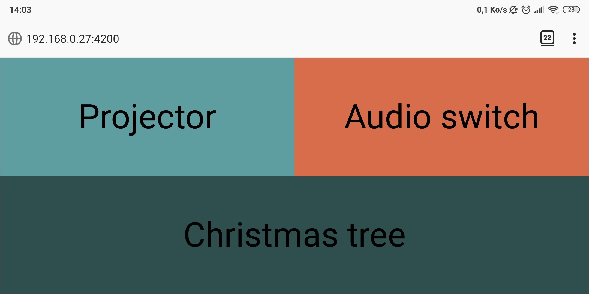
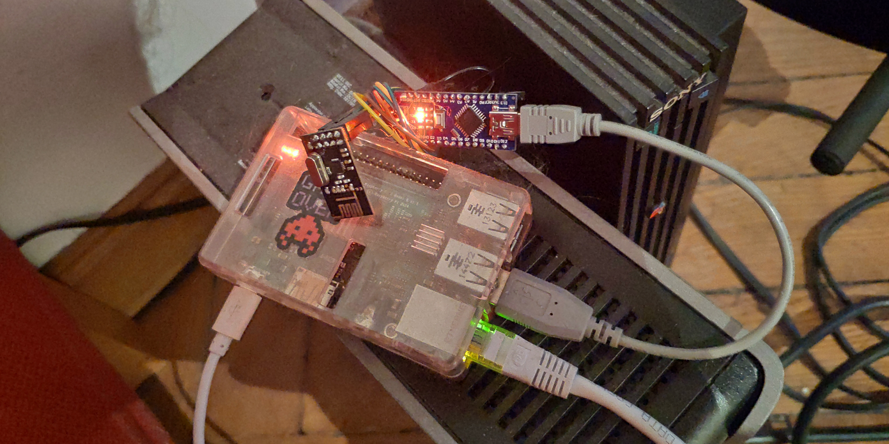
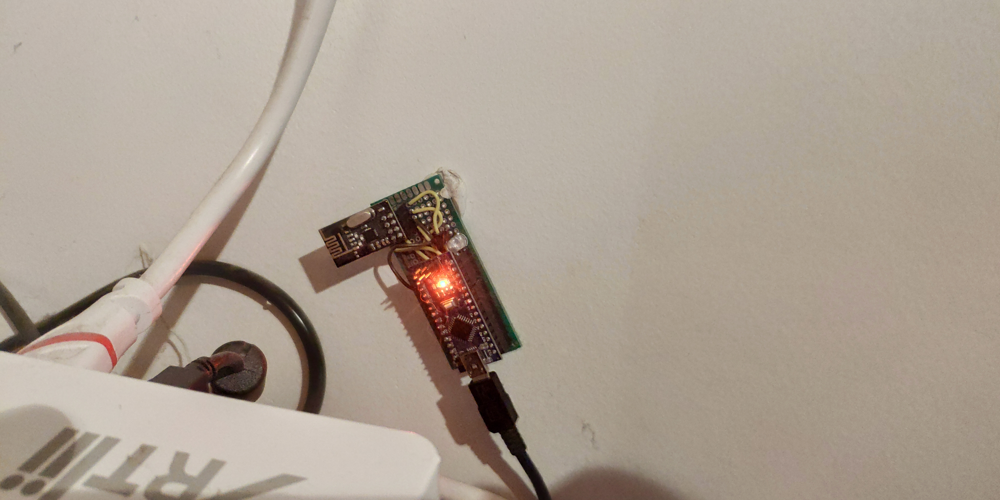
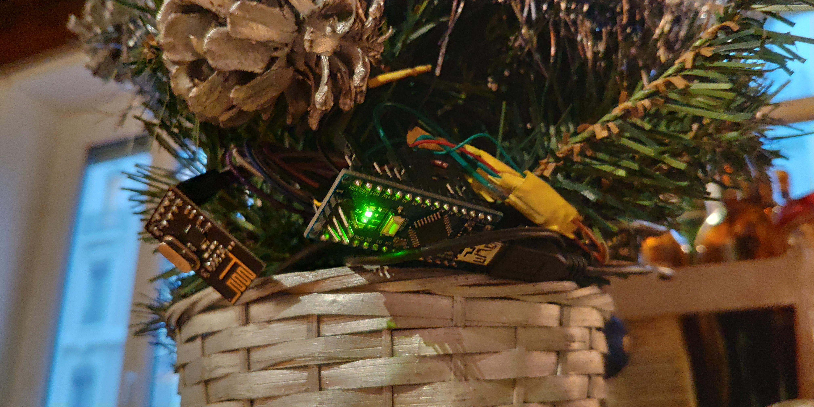
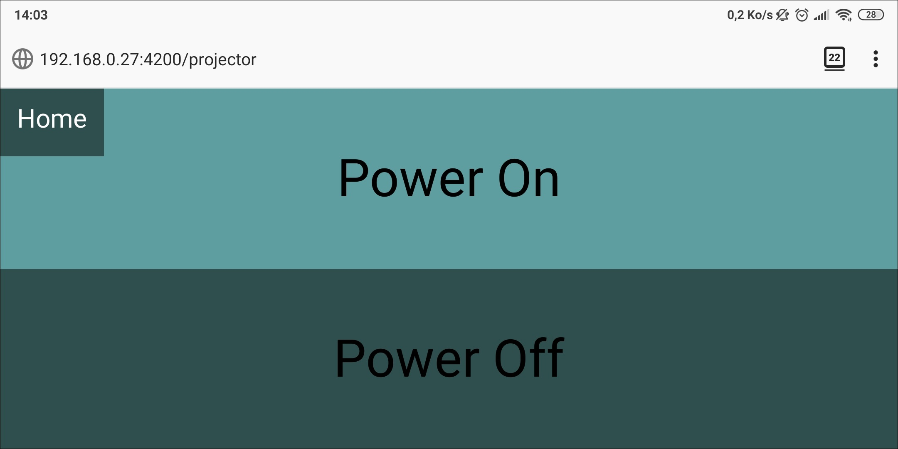
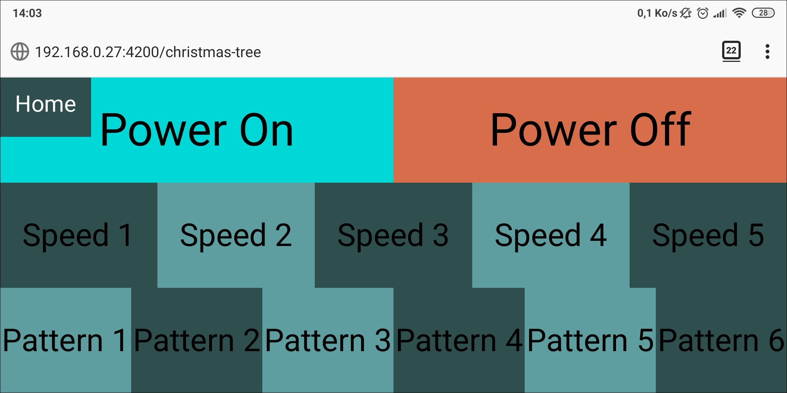
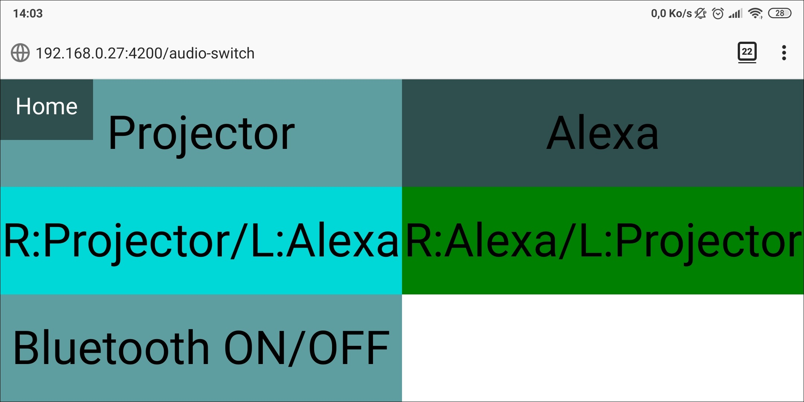

# Home Automation 

This is a DIY Home Automation project.

  

  
  
Home Automation is amazing, but it can sometime be expensive.  
Also it is often generic devices like Lamps, outlet or switchs and comes expenssive when talking of connected devices like tv's or sound systems.
  
So I said to myself : why not making it yourself ?  
And so I started making it !  

# Current state

The current connected devices are : 
- A Video projector : Only for Power On/Off and Volume +/-
- An Audio switch : Can switch between 2 stereo audio channels, cross the 2 channels (Left/Right) and switch On/Off a connected Bluetooth receiver.
- A Chrismas garland : Power On/Off, Set Speed and Change Pattern

The "Automation Hub" is a Raspberry pi 2B.

# Common features

All these devices have 2 things in common : an Arduino Nano and a RF24 Radio Module.  
The Arduino Nano is cheap, low consumption and powerfull enought for such projects.  
I could also have used an ESP8266 NodeMCU that have built in Bluetooth, Wifi, low consumption and is even able to directly communicate with existing Home Automation Systems, but i  didn't have such at the time I started this project and it also more "fun" to do it from scratch \!  
The arduinos use the same base program that I wrote in order to identify the targetted device and the content of the received message.  
All the devices receive all the messages but only process those that concern it.  
Even the RPI is connected to an Arduino which serves as a transmitter. I made it like this cause, unfortunatelly, the RF24 modules that a have are cheap counterfaits and they doesn't work very well with RPI directly.  
At the end it allow me to have only 1 code in C for the Radio part.  

# Raspberry side

As said upper, the RPI is the Automation Hub, the brain of it all.  
It runs a Python/Flask server that convert HTTP request for the Arduino transmitter.  
The converted message is transmited to the arduino over Serial and then to the devices over Radio.  

  

It also runs a NodeJS/Angular server to render a Web Panel.  
This server simply communicate with the Python server.  
Of course, it's an intern panel, so the design may be simple, but functional.  
It allow to controll the devices with any internet connected device like a Computer or a SmarPhone.  

Finaly, it runs a Fauxmo server that emulates Belkin WeMo devices in order to easily enable a communication with Personnal Assistants like Alexa, Siri or Google Home.  
It simply a Python script that take a json file configuration where simples actions like On/Off are binded to a HTTP request.  

I Recently install a Domoticz server in order to get more controll over the devices such as Volume for the projector, which is a trick where I define the Projector as a variable light, but it works \!  
In order to make it clean, I would have to develop custom devices Python scripts for Domoticz, and unfortunatelly, the documentation is not really good, so I paused it.  

# Projector side

It was the first device that I made.  
It only have a InfraRed Transmiter Led and use the built in IR library to send signal to the Projector, like if it was a remote.  
The only "special" feature is for the volume, the Arduino receive a number between 0 and 100 and send x time the Vol+ or Vol- signal.  

  

# Christmas garland

This one was made after I retrieve a 16 Led garland that I made a while ago.  
After that I retrieve how to individualy controll the Leds, which are connected on a 4 by 4 matrix, which give only 8 cables for 16 Leds, allowing to use a single Arduino Nano with it's 12 Digital pins, I wrote some simple parttern, implement a speed and n On/Off system, and voila \!  
The arduino then simply receive messages that contains a command and some arguments and process them.  

  

# Audio switch

  

  

I made this device to be able to quickly and remotly change the current audio channel of my sound system.  
I already had an Audio switch but it was a passive and physical one where you have to push buttons on it.  
So i just opened it and bypassed the physical buttons with relays controlled by the arduino.  
I only bypass 2 button on 4 as it is enought for my usages. I also relaced the buttons with Red Leds to show the current active channel.  
I also recently add another relay to turn On/Off a Bluetooth receiver connected to the Audio switch.  

  

# Demos

  
Controlling the Christmas Garland over the Web Interface.  

  
Projector page of the Web Interface.  

  
Chrismas Garland page of the Web Interface.  

  
Audio switch page of the Web Interface.  